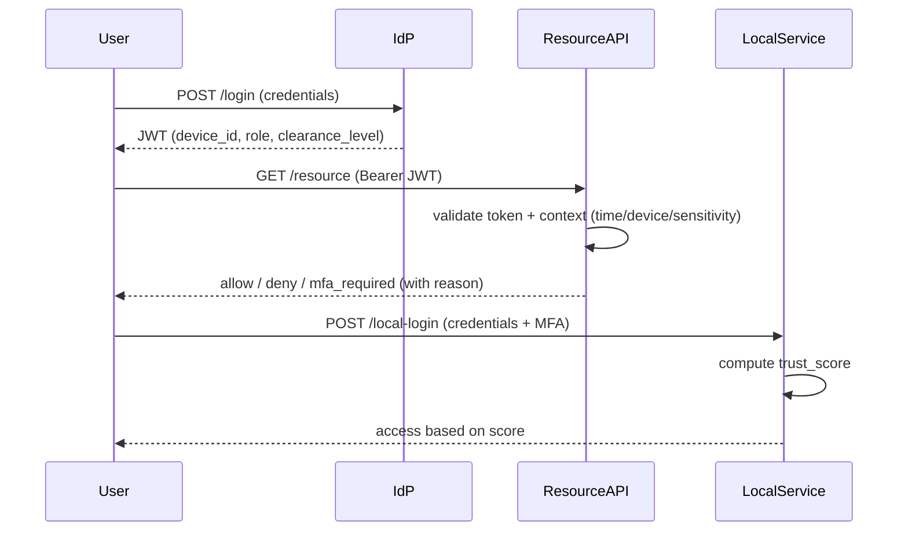

# Architecture Analysis – Authentication and Verification in Distributed Zero Trust Architectures

## 1. Overview

This report analyses our implemented **Zero Trust prototype** based on the provided FastAPI/Docker setup from  
[bfh-architecture/zt-starter](https://github.com/bfh-architecture/zt-starter).

The solution extends the baseline (`zt-starter`) with both:

- **Centralised authentication** (via Identity Provider + Resource API), and
- **Decentralised authentication** (via a standalone Local Service).

It introduces **context-based verification** at the resource level to reflect the principle:

> “Trust is earned per request — not assumed by network location.”

---

### Implemented Services

| Service          | Role                         | Description                                                                            |
| ---------------- | ---------------------------- | -------------------------------------------------------------------------------------- |
| `idp/`           | Identity Provider            | Issues signed JWTs with extended claims (`device_id`, `role`, `clearance_level`, etc.) |
| `resource_api/`  | Resource Service             | Verifies JWTs and enforces contextual verification rules per request                   |
| `local_service/` | Local Authentication Service | Performs independent username/password + MFA authentication with local trust scoring   |

Each service runs in its own Docker container and exposes a REST API.  
`make test-curl` confirms a successful login via IdP and access to the Resource API.

---

## 2. Centralised Authentication and Contextual Verification

The **Identity Provider (IdP)** issues signed JWTs with extended and standard claims:

```json
{
  "sub": "user123",
  "role": "admin",
  "device_id": "device42",
  "clearance_level": "Restricted",
  "iss": "http://localhost:8001",
  "aud": "resource-api",
  "exp": "...",
  "jti": "uuid4()"
}
```

### Implementation Highlights (`idp/app.py`)

- **Added RFC 7519–compliant claims:** `iss`, `aud`, `nbf`, `jti`, and `organization`.
- **Extended user roles and clearance levels** to reflect dynamic access requirements.
- **`JWT_SECRET` and algorithm** loaded securely from `.env`.
- **Token validity** duration defined via environment variable for flexibility.

---

### Contextual Policy Evaluation (`resource_api/context.py`)

The **Resource API** validates tokens and enforces contextual rules per request.

#### JWT Validation

- Checks `aud`, `exp`, `signature`, and the newly added `iss` claim.
- Ensures tokens are signed by the trusted IdP and not expired.

#### Contextual Evaluation

- **Time-based:** Access allowed only between **07:00–19:00**.
- **Device-based:** Access denied if `device_id` is missing or not in the trusted device list.
- **Sensitivity-based:** Stricter rules for **`/export`** and **`/admin`** routes.

#### Example Response Logic (simplified)

```python
decision, reason = evaluate_request_context(claims, path, method)
if decision == "deny":
    raise HTTPException(status_code=403, detail=f"Access denied: {reason}")
elif decision == "challenge":
    return {"status": "mfa_required", "reason": reason}
return {"status": "allow", "user": claims["sub"]}
```

**Sample reasons returned:**

- `Access denied: outside business hours`
- `Access denied: device not trusted`
- `MFA required: sensitive endpoint`

This ensures that **trust is earned per request**, not inherited from session or network.

---

### Trust Boundaries

The **Resource API** trusts only:

- The **cryptographic signature** of the JWT (IdP authority),
- Verified **claims** (`device_id`, `role`, `clearance_level`),
- The current **context** (time, endpoint sensitivity).

---

## 3. Decentralised Authentication (Local Service)

The **Local Service** operates independently from the central IdP.  
It provides **local username/password login**, an **MFA challenge**, and **dynamic trust scoring**.

### Implementation Highlights (`local_service/app.py`)

- **Local user authentication:** username/password validated internally.
- **Multi-Factor Authentication:** one-time verification code.
- **Short-lived local tokens:** stored in a local session store.
- **Dynamic trust score:** computed using:
  - Time of day
  - User role
  - Device trust

---

### Access Logic

| Trust Score Range | Access Level                         |
| ----------------- | ------------------------------------ |
| `< 30`            | Access denied                        |
| `70–90`           | Normal access                        |
| `≥ 90`            | Elevated privileges (`/local-admin`) |

---

### Trust Boundaries

The **Local Service** trusts only its own **session store**, **MFA process**, and **local trust metrics**.  
It does **not depend** on the IdP or external tokens.

This creates a **self-contained Zero Trust domain** that enforces contextual access independently.

---

## 4. Comparative Analysis and Conclusions

### 4.1 Comparison of the Two Approaches

| Aspect                    | Centralised (IdP + Resource API)            | Decentralised (Local Service)       |
| :------------------------ | :------------------------------------------ | :---------------------------------- |
| **Authentication Source** | JWT issued by IdP                           | Local credentials + MFA             |
| **Context Enforcement**   | Time, device, sensitivity (in `context.py`) | Trust score (time, device, role)    |
| **Design Complexity**     | Moderate – unified policies                 | Higher – risk of policy drift       |
| **Latency / Performance** | Low – token validation only                 | Very low – no external dependency   |
| **User Experience**       | Unified login, single sign-on feel          | Local login + extra MFA step        |
| **Trust Boundary**        | IdP + Resource API                          | Local service                       |
| **Scalability**           | Easy to scale via JWT/JWKS                  | Harder to coordinate across domains |

---

### 4.2 Design Considerations and Trade-offs

| Dimension           | Discussion                                                                                                        |
| ------------------- | ----------------------------------------------------------------------------------------------------------------- |
| **Governance**      | Central model enables unified identity and logging; local autonomy can cause divergence.                          |
| **Resilience**      | Local service continues if IdP unavailable; central model can cache JWKS to mitigate downtime.                    |
| **Security Depth**  | Both implement “never trust, always verify”; central uses cryptographic claims, local uses runtime trust scoring. |
| **Maintainability** | Central: simpler updates; Local: duplicated logic.                                                                |
| **User Journey**    | Central: predictable; Local: adaptive but less consistent.                                                        |

---

### 4.3 Conclusions

- **Centralised authentication** offers consistent, auditable identity and governance.
- **Decentralised authentication** adds flexibility and resilience for isolated domains.
- **Contextual verification** (time, device, sensitivity) adds measurable Zero Trust value to both.
- A **hybrid approach** could combine central token issuance with local context enforcement.

> Zero Trust is less about _where_ authentication happens, and more about **continuous, context-aware verification for every request**.

---

## 5. Recommendations and Visual Summary

### 5.1 Recommendations

- **Replay protection:** Use dynamic `jti` (UUID) and maintain optional revocation list.
- **External policy engine:** Integrate _Open Policy Agent (OPA)_ for policy-as-code.
- **Challenge flow:** Replace simulated MFA with real TOTP or email challenge.
- **Policy drift:** Mitigate by sharing testable templates between IdP and local service.
- **Observability:** Add decision logs (`sub`, `jti`, `decision`, `reason`) for audit.

---

### 5.2 Visual Sequence – Zero Trust Flows



## 6. Changes to Starter Code (Summary)

| File                      | Change                                                                                                  |
| ------------------------- | ------------------------------------------------------------------------------------------------------- |
| `idp/app.py`              | Added extended JWT claims (`iss`, `aud`, `nbf`, `jti`, `organization`, `clearance_level`, `device_id`). |
| `idp/.env`                | Added environment variables for JWT signing and token validity.                                         |
| `resource_api/context.py` | Implemented time-, device-, and sensitivity-based contextual access logic with human-readable reasons.  |
| `resource_api/auth.py`    | Implemented JWT validation (`aud`, `iss`, `exp`, `signature`).                                          |
| `resource_api/app.py`     | Integrated contextual evaluation results (`allow`, `deny`, `challenge`).                                |
| `local_service/app.py`    | Implemented local login, MFA simulation, and trust scoring system.                                      |
| `docker-compose.yml`      | Ensured all services run independently and communicate via bridge network.                              |

---

## 7. Summary

Our implementation demonstrates how a minimal **FastAPI-based architecture** can evolve into a **Zero Trust–compliant system** through:

- **Centralised token verification** with contextual checks, and
- **Decentralised authentication** with adaptive trust scoring.

Both reinforce the principle:

> **“Never trust, always verify – for every request.”**
